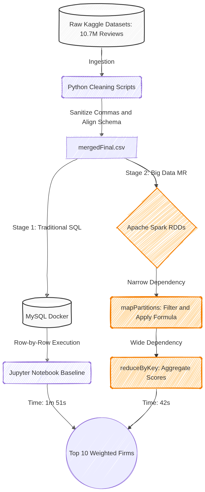

# glassdoor-project
Fat Data Dudes


<pre><code>```text
glassdoor-project/
├── .gitignore                              # Ignores /data, pycache, and .venv
├── Data_Processing_and_SQL_Baseline.ipynb  # Section 2: Baseline & Cleaning
├── Makefile                                # Automated execution commands
├── README.md                               # Project documentation & architecture
├── docker-compose.yml                      # MySQL environment setup
├── requirements.txt                        # Python dependencies
├── python/                                 # Data cleaning & schema alignment
│   ├── calculate-weights.py
│   ├── clean-commas.py
│   ├── company_name_extractor.py
│   ├── drop_columns.py
│   ├── rename_columns.py
│   └── reorder_columns.py
├── spark/                                  # Big Data MapReduce Optimizations
│   ├── rdd-query-spark.py                  # Final Section 3 (Optimized RDD Core)
│   ├── rdd-parquet-spark.py                # Serialization tax experiment
│   ├── sql-query-spark.py                  # DataFrame baseline experiment
│   ├── WeightedRating.scala                # JVM native logic formulation
│   ├── rdd-query-spark-all-core.py         # CPU core scaling experiment
│   ├── csv_to_parquet.py                   # Utility to convert raw CSVs to Parquet
│   └── GlassdoorAnalysis.scala             # High-throughput JVM-native processing (25s)
├── report/                                 # Academic submission
│   └── report.md
└── screenshots/                            # Assets for README and Report
└── SQLvsSparkOrderByNewWeights.png



## 1. FIRST TIME Setup
### 1. Install system dependencies (Ubuntu)
```bash
sudo apt update
sudo apt install -y git docker.io docker-compose python3 python3-venv python3-pip openjdk-11-jdk make mysql-client
```
### 2. Enable Docker
```bash
sudo systemctl enable --now docker
sudo usermod -aG docker $USER
newgrp docker
```
### 3. Clone the repository

```bash
git clone https://github.com/DavidRemenyik/glassdoor-project.git
cd glassdoor-project
```

### 4. Create Python virtual environment
```bash
make venv
```

### 5. Install Python dependencies
```bash
make install
```

### 6. Start MySQL Docker container
```bash
make up
```

### 7. Activate Python environment
```bash
source .venv/bin/activate

```
### 8. Docker container
```bash
docker ps
```

### 9. MySQL
```bash
mysql --local-infile=1 -h 127.0.0.1 -u root -prootpw
```

```mysql
SHOW DATABASES;
EXIT;
```

### 9. Adding a table
```mysql
use glassdoor;

CREATE TABLE users (
    id INT,
    first_name VARCHAR(50),
    last_name VARCHAR(50),
    email VARCHAR(100),
    age INT,
    city VARCHAR(50)
);

LOAD DATA LOCAL INFILE 'raw/testingCSV.csv'
INTO TABLE users
FIELDS TERMINATED BY ','
LINES TERMINATED BY '\n'
IGNORE 1 ROWS;
```
## 2. Daily Use
### 1. Start MySQL Docker container
```bash
make up
```
### 2. Activate Python environment
```bash
source .venv/bin/activate
```

### 3. (Optional) Launch Jupyter notebooks
```bash
make jupyter
```

### 4. Run Spark or Shell scripts as needed
### e.g., python python/calculate-weights.py
### or run shell scripts in shell/

### 5. When finished, stop Docker
```bash
make down
```


